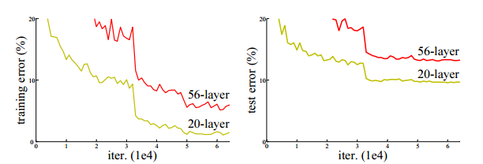
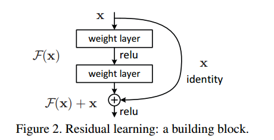
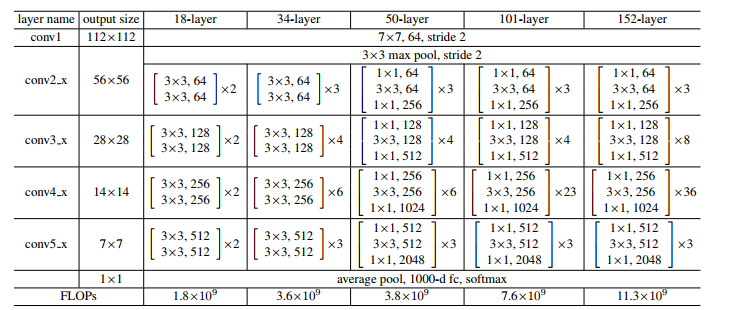

# ResNet  
深度卷积神经网络在图像分类方面取得了一系列突破。深度网络以端到端的多层方式自然地集成低/中/高级特征和分类器，并且特征的“级别”可以通过堆叠层的数量(深度)来丰富。最近的证据表明网络深度是至关重要的，在具有挑战性的ImageNet数据集上的领先结果都利用了“非常深”模型，深度为16到30。但当深度越高时候却会产生退化问题（不同于过拟合，证明如下图），ResNet则可以解决这个问题。  


## 优点  
1.残差连接：ResNet引入了残差连接，通过将输入直接添加到网络的输出，构建了一个跳跃连接（skip connection），用于传递梯度和信息。这使得网络可以学习残差映射，即学习输入与输出之间的差异。这种连接方式有助于减轻梯度消失问题，让深层网络能够更容易地学习和优化。    

  

2.残差模块：ResNet的基本构建块是残差模块，每个模块由两个或三个卷积层组成。残差模块通过残差连接实现了跨层的信息传递，使得网络可以学习更复杂的特征表示。这种模块化的结构使得网络的训练更加容易，同时也减少了参数量。  

3.预训练和迁移学习：由于ResNet在大规模图像分类任务（如ImageNet）上取得了出色的性能，预训练的ResNet模型可以作为通用的图像特征提取器，并用于其他计算机视觉任务。这种预训练和迁移学习的优势使得ResNet成为了许多领域的研究和实际应用的首选模型。
## 模型结构  
  
## 代码  
```py
import torch
import torch.nn as nn

# 定义基本的残差块
class BasicBlock(nn.Module):
    def __init__(self, in_channels, out_channels, stride=1):
        super(BasicBlock, self).__init__()
        self.conv1 = nn.Conv2d(in_channels, out_channels, kernel_size=3, stride=stride, padding=1, bias=False)
        self.bn1 = nn.BatchNorm2d(out_channels)
        self.relu = nn.ReLU(inplace=True)
        self.conv2 = nn.Conv2d(out_channels, out_channels, kernel_size=3, stride=1, padding=1, bias=False)
        self.bn2 = nn.BatchNorm2d(out_channels)
        self.shortcut = nn.Sequential()
        if stride != 1 or in_channels != out_channels:
            self.shortcut = nn.Sequential(
                nn.Conv2d(in_channels, out_channels, kernel_size=1, stride=stride, bias=False),
                nn.BatchNorm2d(out_channels)
            )

    def forward(self, x):
        residual = x
        out = self.conv1(x)
        out = self.bn1(out)
        out = self.relu(out)
        out = self.conv2(out)
        out = self.bn2(out)
        out += self.shortcut(residual)
        out = self.relu(out)
        return out

# 定义ResNet模型
class ResNet(nn.Module):
    def __init__(self, block, num_blocks, num_classes=10):
        super(ResNet, self).__init__()
        self.in_channels = 64
        self.conv1 = nn.Conv2d(3, 64, kernel_size=3, stride=1, padding=1, bias=False)
        self.bn1 = nn.BatchNorm2d(64)
        self.relu = nn.ReLU(inplace=True)
        self.layer1 = self.make_layer(block, 64, num_blocks[0], stride=1)
        self.layer2 = self.make_layer(block, 128, num_blocks[1], stride=2)
        self.layer3 = self.make_layer(block, 256, num_blocks[2], stride=2)
        self.layer4 = self.make_layer(block, 512, num_blocks[3], stride=2)
        self.avg_pool = nn.AdaptiveAvgPool2d((1, 1))
        self.fc = nn.Linear(512, num_classes)

    def make_layer(self, block, out_channels, num_blocks, stride):
        layers = []
        layers.append(block(self.in_channels, out_channels, stride))
        self.in_channels = out_channels
        for _ in range(1, num_blocks):
            layers.append(block(out_channels, out_channels))
        return nn.Sequential(*layers)

    def forward(self, x):
        out = self.conv1(x)
        out = self.bn1(out)
        out = self.relu(out)
        out = self.layer1(out)
        out = self.layer2(out)
        out = self.layer3(out)
        out = self.layer4(out)
        out = self.avg_pool(out)
        out = torch.flatten(out, 1)
        out = self.fc(out)
        return out

# 创建ResNet-18模型
def ResNet18(num_classes=10):
    return ResNet(BasicBlock, [2, 2, 2, 2], num_classes)

# 创建ResNet-34模型
def ResNet34(num_classes=10):
    return ResNet(BasicBlock, [3, 4, 6, 3], num_classes)

```

```py
#用在训练集中
loss = nn.CrossEntropyLoss(reduction='none’)

#用在验证集中
def evaluate_loss(data_iter, net, devices):
    l_sum, n = 0.0, 0
    for features, labels in data_iter:
        outputs = net(features)
        l = loss(outputs, labels)
        l_sum += l.sum()
        n += labels.numel()
    return l_sum / n
```
