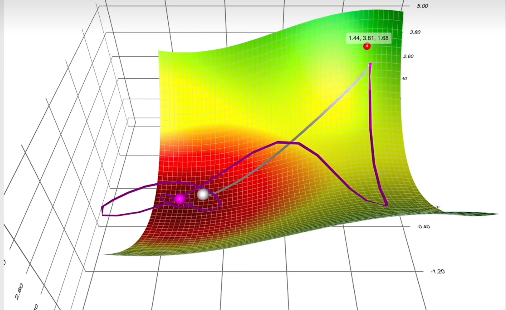
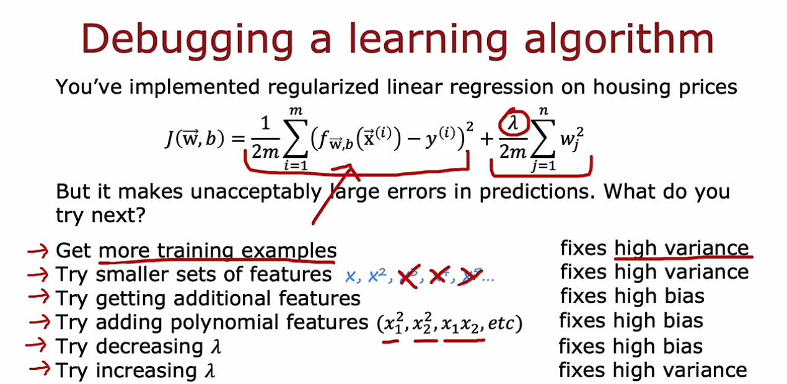

# 机器学习基础
## 线性回归与逻辑回归
### 监督学习与非监督学习
监督学习（Supervised Learning）：

数据：监督学习使用带有标签的数据进行训练。每个训练样本都由输入特征和对应的标签组成。输入特征是模型的输入，标签是对应的目标输出。

目标：监督学习的目标是通过对输入特征和标签之间的关系进行学习，构建一个能够准确预测新样本标签的模型。模型通过最小化预测值与真实标签之间的差异，例如使用损失函数计算预测误差并通过反向传播算法优化模型参数。

非监督学习（Unsupervised Learning）：

数据：非监督学习使用未标记的数据进行训练，即没有对应的标签。数据只包含输入特征，没有与之对应的目标输出。

目标：非监督学习的目标是从数据中发现隐藏的结构、模式或特征。这种学习方式更加依赖于数据本身的统计特性和信息。常见的非监督学习任务包括聚类（将相似样本分组）。
### 损失函数
1.均方误差损失函数:   

对于
$$
f_w(x)=w x+b
$$  
目的是求
$$
\underset{w, b}{\operatorname{min}} J(w, b)
$$  
损失函数
$$
J(w, b)=\frac{1}{2 m} \sum_{i=1}^m\left(f_{w, b}\left(x^{(i)}\right)-y^{(i)}\right)^2
$$

2.交叉熵损失函数:    

对于  
$$
f_{\overrightarrow{\mathrm{w}}, b}(\mathrm{x})=\frac{1}{1+e^{-(\overrightarrow{\mathrm{w}} \cdot \mathrm{x}+b)}}
$$ 
当然激活函数可以是别的，目标是一个概率，其中$z=\overrightarrow{\mathrm{w}} \cdot \overrightarrow{\mathrm{x}}+b$表示这个逻辑回归的决策边界，它可以是各种形状，比如圆形或者是高维的。则下面是它的损失函数:    
$$
L\left(f_{\overrightarrow{\mathrm{w}}, b}\left(\overrightarrow{\mathrm{x}}^{(i)}\right), y^{(i)}\right)=\left\{\begin{aligned}
-\log \left(f_{\overrightarrow{\mathrm{w}}, b}\left(\overrightarrow{\mathrm{x}}^{(i)}\right)\right) & \text { if } y^{(i)}=1 \\
-\log \left(1-f_{\overrightarrow{\mathrm{w}}, b}\left(\overrightarrow{\mathrm{x}}^{(i)}\right)\right) & \text { if } y^{(i)}=0
\end{aligned}\right.
$$  
可以看出当预期概率为1时，在0到1之间时下降的，想让损失函数$-\log \left(f_{\overrightarrow{\mathrm{w}}, b}\left(\overrightarrow{\mathrm{x}}^{(i)}\right)\right)=0$时，这个时候$f_{\overrightarrow{\mathrm{w}}, b}\left(\overrightarrow{\mathrm{x}}^{(i)}\right)$只能取1。另一种情况同样如此。而最终简化后的公式则是这样的：
$$
L\left(f_{\overrightarrow{\mathrm{w}}, b}\left(\overrightarrow{\mathrm{x}}^{(i)}\right), y^{(i)}\right)=-y^{(i)} \log \left(f_{\overrightarrow{\mathrm{w}}, b}\left(\overrightarrow{\mathrm{x}}^{(i)}\right)\right)-\left(1-y^{(i)}\right) \log \left(1-f_{\overrightarrow{\mathrm{w}}, b}\left(\overrightarrow{\mathrm{x}}^{(i)}\right)\right)
$$
### 特征缩放    
   

**防止特征尺度不平衡带来的影响：** 当特征的尺度差异较大时，某些特征的值范围可能会远远超过其他特征。这可能导致模型在处理具有较大尺度的特征时过于关注这些特征，而忽略了其他特征的影响。通过进行特征缩放，可以将特征调整到相似的尺度，使得模型能够更加平衡地考虑各个特征的影响。(比如二维数据变成一维数据)

**加快模型收敛速度：** 在某些优化算法中，如梯度下降，特征的尺度差异可能导致算法收敛速度较慢。尺度较大的特征可能会导致梯度更新幅度过大，从而导致算法在这些特征上过度调整。通过特征缩放，可以使得不同特征的梯度变化范围相对一致，有助于加快算法的收敛速度。(像自适应学习率方法中的Adagrad算法，将学习率除以一个历史梯度Hadamard积的二范数，实现梯度数值归一化，避免了梯度更新幅度过大的问题，求稀疏矩阵更加平滑)

**避免数值计算问题：** 在某些情况下，特征的尺度差异可能导致数值计算问题。例如，某些优化算法可能在特征的尺度较大时产生数值溢出或不稳定的情况。通过将特征缩放到合适的范围，可以减少这些数值计算问题的发生。(各种误差)  

常见的特征缩放方法包括标准化和归一化。标准化通过减去特征的均值并除以标准差，将特征调整为均值为0、标准差为1的分布。归一化将特征缩放到特定的范围，如[0, 1]或[-1, 1]。

### 梯度下降  

$$
\begin{aligned}
& w = w-\alpha \frac{\partial}{\partial w} J(w, b)   
& b = b-\alpha \frac{\partial}{\partial b} J(w, b)
\end{aligned}
$$  
其中$\alpha$为学习率，学习率的设置不应过大或过小。一般可以采用学习率衰减策略或自适应学习率方法。自适应学习率引入动量这个概念加速了梯度收敛，后又有了AdaGrad，RMSprop，Adam算法。下面为Adam算法。
 

其中第三行$m_t$用的是指数加权移动平均法，由 $W_{(t) i}=W_{(t-1) i}+\eta \cdot (V_{(t-1)}+\Delta W_{(t) i})$其中$V_{(t)}=V_{(t-1)}+\Delta W_{(t) i}$而来，其中后面括号里V表示的是之前的$W$之和，这其实就是动量法的思想，有种物理上惯性的感觉，而指数加权移动平均法目的是增大上一个的权值(一般$\beta$设置为0.9)，其主要针对的是梯度。  

而第四行这个公式表示对Hadamard积使用指数移动平均法的进行更新。**不同于第三行梯度下降方式进行优化，其目的是针对学习率进行优化**，v的计算是通过将上一时刻的指数移动平均乘以梯度平方衰减参数（β2）并加上当前Hadamard积的一部分来实现。(其实就是RMSprop算法，相较于AdaGrad下降更快一点，避免了因历史部分缓慢，而导致下降缓慢)  

第四五行中"bias-corrected"是指对估计值进行修正，以纠正由于算法初始条件或计算过程引入的偏差。这是因为在算法的初始阶段，这些估计值可能会受到初始化条件的影响，导致偏差较大。

**补充adagrad法:** 学习率除以一个历史梯度Hadamard积之和的二范数，adagrad本质是解决各方向导数数值量级的不一致而将梯度数值归一化，梯度太大的把它搞小一点。如下图，其中紫色为动量法，灰色为对动量进行归一化的。

## 误差和偏差
  
上图为解决偏差和方差的一些方法，其中高方差意味着过拟合，即在一个数据集表现很好而在另一个数据集表现很差，那么最简单的方法则为添加数据。高偏差意味着学习效果很差，这点从历史模型的发展可以看出，随着模型发展的越来越深，偏差越来越小。  
