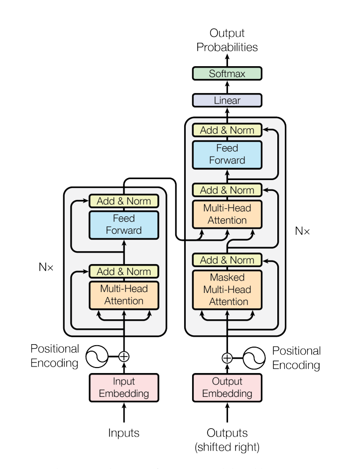

# Transformer
本文从相关知识开始逐步讲解transformer
<!-- more -->
## 相关知识
本章节主要介绍编码器与解码器，注意力机制的起源，也是transformer论文的灵感来源。
### 编码器与解码器
编码器-解码器（Encoder-Decoder）架构在不同的领域和任务中有不同的首次提及。在自然语言处理领域，特别是在序列到序列（seq2seq）模型中，这种架构被广泛应用于机器翻译等任务。而在计算机视觉领域，如**图像分割**任务中，SegNet是最早提出并使用编码器-解码器架构的网络之一，其论文为《SegNet: A Deep Convolutional Encoder-Decoder Architecture for Image Segmentation》。

最初的编码器解码器使用的是基于cnn的结构，并用于图像分割，SegNet 的核心是一个编码器网络，它与 VGG16 网络的前 13 个卷积层在拓扑上是相同的，以及一个相应的解码器网络，其作用是将低分辨率的编码器特征图映射回原始输入分辨率的特征图，以便进行像素级的分类。SegNet 的创新之处在于解码器上采样低分辨率输入特征图的方式，它使用编码器最大池化步骤中计算的池化索引来执行**非线性上采样**，从而消除了上采样的学习需求。

### 注意力机制

Transformer原文中在介绍注意力机制的部分有下面这句话：

  

那么所谓的相加性质的注意力函数到底是怎么回事呢？在NLP相关论文对齐翻译NEURAL MACHINE TRANSLATION BY JOINTLY LEARNING TO ALIGN AND TRANSLATE中首次提到这种注意力函数，论文首次提出了一种新的神经机器翻译方法。这种方法的核心思想是，不同于传统的编码器-解码器模型将整个源句子编码成一个固定长度的向量，该方法允许模型在生成目标词汇时，自动地（软搜索）寻找与预测目标词最相关的源句子部分，而不必显式地将这些部分形成硬片段。
  
上图为该论文中所使用方法模型的示意图，本文中将使用自顶向下的方法由解码器开始来解读。   

$$
p(y_{i} \mid y_{1}, \cdots, y_{i-1}, x) = g(y_{i-1}, s_{i}, c_{i})
$$
这是解码器最终输出目标词y的计算公式，可以看出他是跟RNN的式子很相似，应用了马尔可夫过程只与前一个输出目标词有关，那公式中剩余的两个参数$s_{i}$, $c_{i}$是什么呢？其中$s_{i}$比较好解释:
$$s_{i}=f\left(s_{i-1}, y_{i-1}, c_{i}\right)$$  
它就是RNN中中间的隐藏状态层，而剩下的参数$c_{i}$又是什么意思呢:
$$ c_i = \sum_{j=1}^{T_x} \alpha_{ij} h_j $$ 
这个在解码器中用到的这个公式就是这里的注意力机制，首先解释其中的参数$h_j$，它的出现是在下层的编码器中，而在编码器中并没有使用普通的RNN的结构，而是使用了双向RNN（BiRNN），每一部分的隐藏状态不但与先前隐藏状态有关，同时也与之后的隐藏状态有关，因此在论文中就给$h_j$起了一个新的名字叫注释（annotations），而从它的表现形式上来看，它是一个针对于输入词的一个向量，而这个向量又由之前的词和之后的词计算而来，代表了输入的词与句子中其它词的相近关系，因此叫注释。  $$ \alpha_{ij} = \frac{\exp\left(e_{ij}\right)}{\sum_{k=1}^{T_x} \exp\left(e_{ik}\right)} $$  
其次是参数$\alpha_{ij}$，它由评分$e_{ij}$求得：
$$ e_{ij} = a(s_{i-1}, h_j) $$  
而评分通过a函数计算来计算编码器与解码器中隐藏状态的相关性，通常是用点乘的方式计算两个向量的相关性评分$e_{ij}$，而显然通过累乘$\alpha_{ij}$（评分占比）与$e_{ij}$（评分）再相加之后就实现了两种语言的对齐，即由输入词的注释转换为输出词的注释。

## Transformer
在理解了编码器解码器以及注意力机制之后再来看transformer中的模型和公式就很好理解了，但是在模型图中并没有详解区分使用的是否是自注意力，只有解码器中子层第二层使用的不是自注意力。
### Transformer中的编码器与解码器  
   
#### 编码器 

Transformer论文中的编码器由N = 6个相同层的堆栈组成。每一层有两个子层。第一种是多头自注意机制，第二种是简单的、位置完全连接的前馈网络。每个子层后面都跟着一个残差连接和层归一化操作：   

* **多头自注意力机制（Multi-Head Self-Attention）子层:** 这一层允许模型在处理每个单词时考虑到整个输入序列，从而捕获序列内部的依赖关系。自注意力机制通过计算每个单词对于序列中所有单词的注意力权重来实现。  

* **前馈神经网络（Feed-Forward Neural Network）：** 这一层对自注意力层的输出进行进一步的非线性变换。   

#### 解码器 
Transformer论文中的解码器也由N = 6层相同的堆栈组成。每个层包含三个重要的子层，每个子层后面都跟着一个残差连接和层归一化操作：

* **掩码多头自注意力（Masked Multi-Head Self-Attention）：** 论文中画的这一层确保解码器在预测每个单词时只能访问到它之前的位置，这是通过使用掩码（Mask）来实现的，以防止信息泄露。
  掩码通常是上三角形矩阵，其中非对角线上方的元素被设置为一个非常大的负数（如负无穷大），这样在经过 SoftMax 函数后，这些位置的注意力权重会接近于零。
  
* **编码器-解码器注意力（Encoder-Decoder Attention）：** 这一层允许解码器关注编码器的输出，从而将源序列的信息融入到目标序列的生成中。这一层使用编码器的输出作为 Key 和 Value，解码器的上一层输出作为 Query。  

* **前馈神经网络（Feed-Forward Neural Network）:** 这一层对自注意力层的输出进行进一步的非线性变换。
### Transformer中的注意力机制  
Transformer论文中提到了两种注意力机制分别是基于缩放的点积自注意力（Scaled Dot-Product Attention）和多头注意力机制（Multi-Head Attention），并在数学公式中提到了QKV三个矩阵，而**区分是否是自注意力的关键就是QK和V是否来源于同一序列内部**。  
  
#### 基于缩放的点积自注意力（Scaled Dot-Product Attention）
理解Transformer中的注意力机制的关键是理解其中的QKV矩阵：

$$\operatorname{Attention}(Q, K, V) = \operatorname{softmax}\left(\frac{Q K^T}{\sqrt{d_k}}\right) V$$ 

在Transfomer论文中提到前文所讲到的注意力为additive attention，而dot-product和它的唯一区别是 $\frac{1}{\sqrt{d_k}}$,但是点乘注意力因为是矩阵运算的原因更快，更节省空间。在$ e_{ij} = a(s_{i-1}, h_j) $中,$ s_{i-1} $对应的便是Q，即待查询的，而$ h_j $对应的便是$ K $，可以理解为查询操作中数据库中的键值，需要遍历它，通过计算查询矩阵Q和键矩阵K的点积，得到一个得分矩阵（scores）对应的便是$ e_{ij} $。 而softmax操作对应的是$ \alpha_{ij} = \frac{\exp\left(e_{ij}\right)}{\sum_{k=1}^{T_x} \exp\left(e_{ik}\right)} $，V对应的是$ c_i = \sum_{j=1}^{T_x} \alpha_{ij} h_j $中的$ h_j $。下面介绍细节操作Scale和Mask：  

* **缩放操作：** 为了稳定训练过程，避免点积结果过大，将得分矩阵的每个元素除以一个缩放因子，通常是键向量维度$d_k$的平方根。这样做是因为在高维空间中，点积的结果可能会非常大，导致 softmax 函数的梯度很小，从而影响模型的学习效率。  
* **掩码操作（在解码器中使用）：** 在解码器中，为了保持输出的自回归特性，需要防止位置关注到后续位置。这通过在计算 softmax 之前应用一个掩码（mask）来实现，将非法位置的得分设置为一个非常大的负数（如负无穷大），这样在 softmax 之后这些位置的权重就会接近于零。而掩码矩阵通常通过上三角矩阵实现出类似前文RNN中只与先前状态有关的隐藏状态。  
#### 多头注意力机制（Multi-Head Attention） 
多头注意力机制（Multi-Head Attention）可以被看作是将普通的注意力机制扩展到了多通道（或多表示子空间）。这种机制通过将输入分割成多个头，每个头独立地学习序列的不同方面或不同特征，然后将这些头的输出合并起来，以此来增强模型的表示能力。多头注意力允许同时在多个子空间中进行计算，这使得模型能够更高效地利用并行计算资源，如 GPU，从而加快训练和推理速度。而且通过在多个头中进行注意力计算，模型能够增加处理的深度，这有助于捕捉更复杂的特征和更长距离的依赖关系。具体的公式如下：
$$
\begin{align*}
\text{MultiHead}(Q, K, V) &= \text{Concat}\left(\text{head}_1, \ldots, \text{head}_h\right) W^O \\
\text{where head}_i &= \text{Attention}\left(Q W_i^Q, K W_i^K, V W_i^V\right)
\end{align*}
$$

