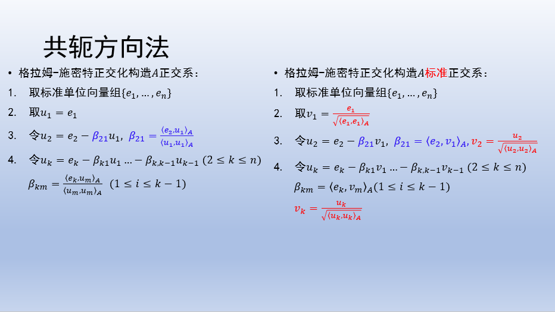
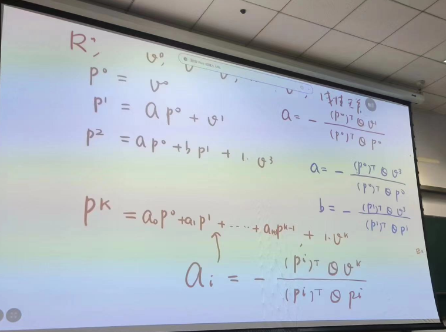

---
tittle: 共轭梯度法
icon: pen-to-square
date: 2023-10-22
category:
  - 课程学习
timeline: false 
tag:
  - 共轭梯度法
  - 数值分析
--- 


# 共轭梯度法  

需要注意共轭梯度法对于n为矩阵，最多只需要n步就可以迭代到最优解，后跟梯度下降进行对比。

<!-- more -->

  
在最优化课程讲到了他的证明。
  
    

现在解决下面问题：

```python
import numpy as np
import pandas as pd


# 共轭梯度法
def conjugate_gradient(A, b, x0, tol=1e-6, max_iter=1000):
    x = x0
    r = b - np.dot(A, x)
    p = r
    rsold = np.dot(r, r)

    table = []
    headers = ["iterations", "x"]


    for i in range(max_iter):
        Ap = np.dot(A, p)
        alpha = rsold / np.dot(p, Ap)
        x = x + alpha * p
        r = r - alpha * Ap
        rsnew = np.dot(r, r)

        table.append([i+1, x])

        if np.sqrt(rsnew) < tol:
            print("Conjugate Gradient converged in", i + 1, "iterations.")
            break

        p = r + (rsnew / rsold) * p
        rsold = rsnew
    df = pd.DataFrame(table, columns=headers)
    df=df.to_string(index=False)
    print(df)

    return x

# 梯度下降法
def gradient_descent(A, b, x0, learning_rate=0.01, tol=1e-6, max_iter=10000):
    x = x0
    residual = np.dot(A, x) - b
    iter_count = 0

    table = []
    headers = ["iterations", "x"]

    while np.linalg.norm(residual) > tol and iter_count < max_iter:
        gradient = np.dot(A.T, residual)
        x = x - learning_rate * gradient
        residual = np.dot(A, x) - b
        iter_count += 1

        table.append([iter_count, x])

    if iter_count == max_iter:
        print("Gradient Descent did not converge within the maximum number of iterations.")
    else:
        print("Gradient Descent converged in", iter_count, "iterations.")

    df = pd.DataFrame(table, columns=headers)

    result_df = pd.concat([df.head(3), pd.DataFrame([["...", "..."]], columns=headers), df.tail(3)]).reset_index(
        drop=True)
    result_df = result_df.to_string(index=False)
    print(result_df)


    return x


# 示例用法
A = np.array([[4, -2, 0], [-2, 2, -1], [0, -1, 5]])
b = np.array([0, 3, -7])
x0 = np.array([0, 0, 0])

print("Conjugate Gradient Method:")
solution_cg = conjugate_gradient(A, b, x0)
print("Solution:", solution_cg)

print("\nGradient Descent Method:")
solution_gd = gradient_descent(A, b, x0)
print("Solution:", solution_gd)
```

    Conjugate Gradient Method:
    Conjugate Gradient converged in 3 iterations.
     iterations                                                             x
              1                [0.0, 0.5704918032786885, -1.3311475409836064]
              2  [0.5945700329433148, 0.8895452307925329, -1.315877163088341]
              3 [1.0000000000000002, 2.0000000000000004, -0.9999999999999998]
    Solution: [ 1.  2. -1.]
    
    Gradient Descent Method:
    Gradient Descent converged in 3915 iterations.
    iterations                                                             x
             1                                          [-0.06, 0.13, -0.38]
             2                       [-0.0848, 0.21450000000000002, -0.6509]
             3                   [-0.089082, 0.26945600000000003, -0.844955]
           ...                                                           ...
          3913  [0.9999991627289648, 1.999998575517787, -1.0000003235489727]
          3914 [0.9999991657162858, 1.9999985806002338, -1.0000003223945741]
          3915 [0.9999991686929481, 1.9999985856645468, -1.0000003212442943]
    Solution: [ 0.99999917  1.99999859 -1.00000032]
    
